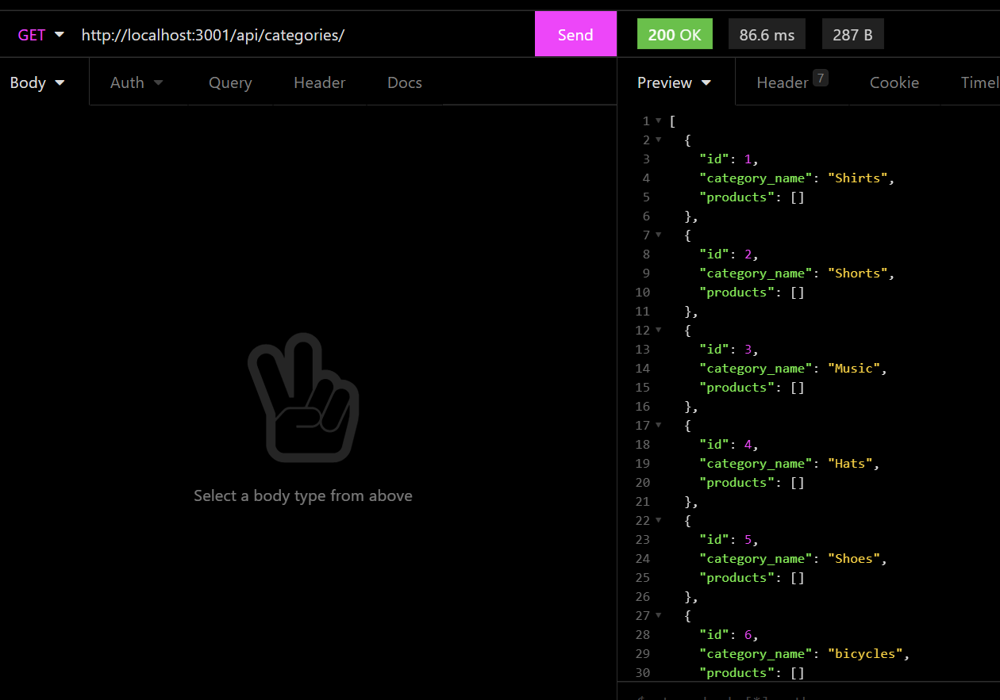

 
  # Online-Retail

  # Table of Contents
  _________________________________

[Description](#Description)

[Installations](#Installations)

[Usage](#Usage)

[Credits](#Credits)

[License](#License)

[Test](#Test)

[Questions](#Questions)
 

  # Description
   AS A manager at an internet retail company I WANT a back end for my e-commerce website that uses the latest technologies SO  THAT my company can compete with other e-commerce companies. GIVEN a functional Express.js API WHEN I add my database name, MYSQL password to an enviroment variable file, THEN I am able to connect to a database using sequelize. WHEN I enter a schema and seed commands THEN a development database is created and is seeded with test data WHEN I enter the command to invoke the application THEN my server is started and sequelize model are synced to the MySql database.

  # Installation
    "MySQL2" "Sequelize" "dotenv"

  # Usage
    "npm run seed" then use "npm start" or "nodemon"

  # Credits
  none

  # License
  
  
  # Test
    npm start or nodemon

  # Questions
  _________________________________

  ## If you have any further questions about this project, you can always contact me here:(Click Enter)

  ## Name
  Fabiola C. Gamboa

  ## [Github](https://github.com/Fabskickass)
  

  ## [Email](fabiscg79@gmail.com)

  ## [Video Demo](https://drive.google.com/file/d/1yycZKum0Byp9rmK1T61Cs3MyLPZmItM1/view)

  ## 

  
